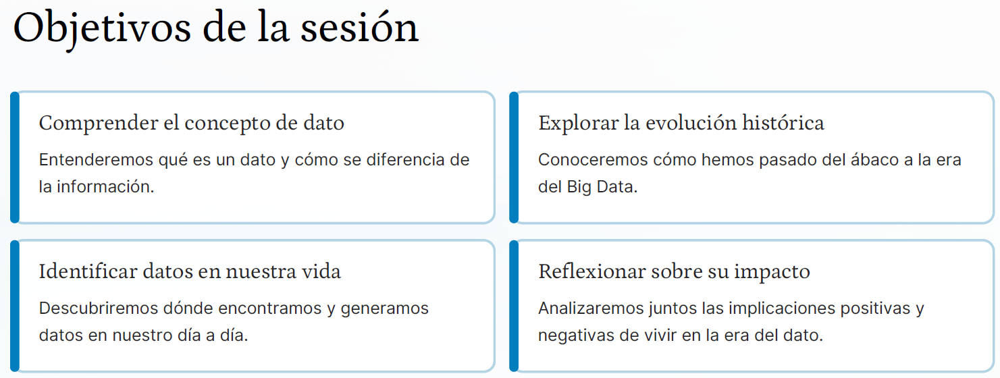
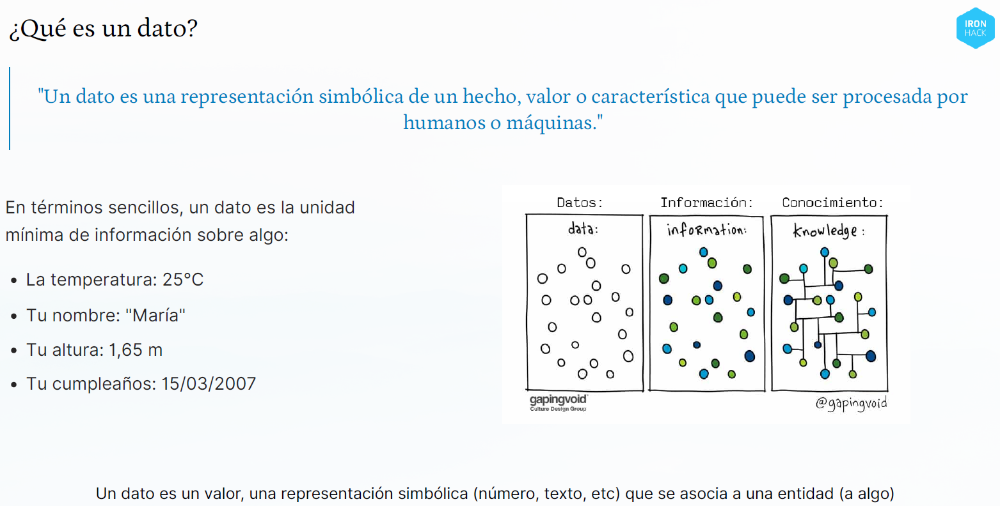
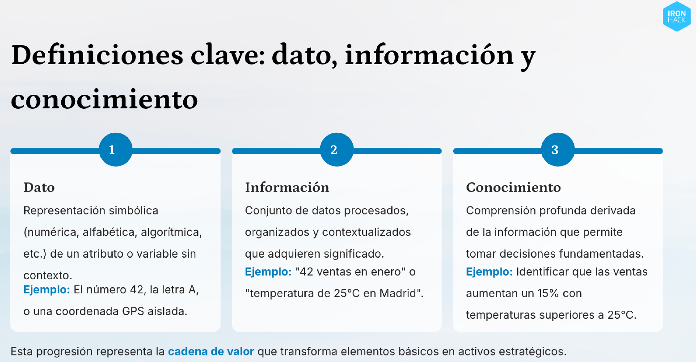

# [Día 1](https://drive.google.com/drive/folders/1T8ZGgFEr0rUGRNHSds2NhddBna0XK2lx): Introducción de los Datos

## Parte 1 - Introducción al mundo de los datos

En este primer día, se aborda la importancia de **crear una cultura de captura de datos** adecuada, que tenga en cuenta el **sentido y el propósito** de los mismos, en función de su **tipo y contexto**.

### Descripción General del Curso
El curso **"Big Data: El Futuro de los Datos"** te sumerge en una nueva era donde **los datos son el "nuevo petróleo"** [1-3]. Su objetivo es proporcionar conocimientos técnicos y visión estratégica para resolver problemas del mundo real, ya que los datos están revolucionando todas las industrias actuales [2]. Se promueve la participación activa, la curiosidad por aprender y el respeto, con una evaluación continua mediante actividades [1].

### Objetivos Clave de la Sesión Introductoria
La primera sesión busca una comprensión profunda del mundo de los datos y cómo estos moldean nuestro presente y futuro [4]. Los objetivos principales son [5]:
*   **Comprender el concepto de dato** y diferenciarlo de la información.
*   **Explorar la evolución histórica** de los datos, desde el ábaco hasta la era del Big Data [6].
*   **Identificar la presencia de datos** en nuestra vida diaria [7, 8].
*   **Reflexionar sobre el impacto** (positivo y negativo) de vivir en la era del dato [9].

### Conceptos Clave
*   **Dato**: Es una **representación simbólica de un hecho, valor o característica** que puede ser procesada por humanos o máquinas [10]. En términos sencillos, es la unidad mínima de información, como una temperatura (25°C), un nombre ("María"), o una altura (1,65 m) [10].
*   **De Dato a Decisión**: Este proceso fundamental ilustra cómo se extrae valor de los datos [6, 10]:
    *   **DATO**: Hechos brutos sin contexto (ej., "38°C").
    *   **INFORMACIÓN**: Datos organizados con contexto (ej., "La temperatura corporal es 38°C").
    *   **CONOCIMIENTO**: Información analizada y comprendida (ej., "Una temperatura de 38°C indica fiebre").
    *   **DECISIÓN**: Acción basada en el conocimiento (ej., "Tomar medicamento para bajar la fiebre").

### La Importancia de Big Data
En el mundo actual, no hay escasez de datos, sino un exceso de información sin procesar [8]. El verdadero valor reside en la capacidad de transformar estos datos en **conocimientos accionables que impulsen decisiones estratégicas** [8]. La analítica de datos permite descubrir patrones ocultos, correlaciones inesperadas y tendencias emergentes que serían imposibles de detectar mediante la observación simple [11].

### Aplicaciones de Big Data en Acción
Big Data tiene un impacto significativo en múltiples sectores [2, 4, 12, 13]:
*   **Personalización**: Netflix personaliza recomendaciones, Amazon predice compras y Spotify crea listas musicales personalizadas [2, 12].
*   **Optimización**: AirBnB optimiza precios y recomendaciones de alojamiento, Zara ajusta inventario prediciendo tendencias de moda, y Waze optimiza rutas y predice el tráfico en tiempo real [12].
*   **Salud**: Mejora diagnósticos médicos, permite tratamientos personalizados, detecta enfermedades tempranamente y optimiza la gestión hospitalaria [12-14].
*   **Sostenibilidad**: Contribuye a la agricultura de precisión, sistemas inteligentes de reciclaje, modelado predictivo de patrones climáticos y monitorización de recursos hídricos [13].
*   **Innovación**: Los coches autónomos de Tesla aprenden de millones de kilómetros de conducción, los Juegos Olímpicos optimizan su logística, y las Ciudades Inteligentes mejoran servicios urbanos mediante sensores [4].

### Historia y Crecimiento Exponencial de los Datos
La historia de los datos se remonta a dispositivos como el Ábaco (13000 a.C.) [6]. Hitpsos clave incluyen el desarrollo de los primeros ordenadores (1940-1950), la creación de Internet y la World Wide Web (1989-1990), la revolución móvil con los smartphones (2000-2010), y la actual era del **Big Data** (2010-Hoy) [6, 7]. La máquina tabuladora de Herman Hollerith (1884) y las primeras pruebas de traducción automática (1954) sentaron bases importantes [7].

La **explosión digital** ha transformado radicalmente la creación, compartición y consumo de datos. En 2023, el 63% de la población mundial está conectada a internet, el 83% posee un smartphone, y las redes sociales han crecido un 300% desde 2012 [15, 16]. Hoy generamos en un solo día más datos que en todo el año 2000 [16]. Ejemplos del volumen de datos incluyen un coche autónomo que genera ~40 TB/hora, un avión ~10 TB/hora, y WhatsApp global ~50 TB/hora [17].

### Datos en la Vida Diaria y sus Tipos

Constantemente generamos y encontramos datos en nuestra vida diaria a través de [7, 8]:
*   **Tecnología**: Móviles, ordenadores, tabletas.
*   **Compras**: Tickets, facturas, tarjetas cliente.
*   **Salud**: Análisis, recetas, pulseras inteligentes [14].
*   **Educación**: Notas, asistencia, expedientes.
*   **Transporte**: Billetes, GPS, aplicaciones de movilidad [18].
*   **Redes Sociales**: Likes, comentarios, tiempo de visualización, ubicaciones compartidas [19].
*   **Compras Online**: Historial de búsquedas, artículos en carrito, valoraciones [18].

Los **tipos de datos cotidianos** son variados e incluyen [17, 20]:
*   **Números**: Edad, altura, precios (ej., 15, 24.5, 100€).
*   **Texto**: Nombres, direcciones, mensajes (ej., "Hola", "Madrid").
*   **Fechas/Horas**: Nacimiento, citas, eventos (ej., 12/05/2023, 15:30h).
*   **Imágenes**: Fotos, dibujos (JPG, PNG, GIF).
*   **Audio/Vídeo**: Canciones, podcasts, películas (MP3, MP4, WAV).
*   **Sensores**: Ubicación GPS, temperatura, movimiento (ej., 40.4168° N, 3.7038° W).

### Fuentes de Datos
Existen numerosas fuentes para obtener datos para análisis y proyectos [21-24]:
*   **Plataformas de Datasets**: Kaggle, UCI Machine Learning Repository (colecciones de datasets para investigación).
*   **Buscadores Especializados**: Google Dataset Search (para encontrar datasets de cualquier temática).
*   **Portales de Datos Abiertos**: AWS Public Datasets, Data.gov, World Bank Open Data, Open Data Portal de la UE, Quandl, GitHub (repositorios de datos), Census Data (US), IMDB Datasets, FiveThirtyEight, Global Health Data Exchange, European Data Portal, OpenStreetMap, scikit-learn Datasets, y portales de datos abiertos gubernamentales de España, México, Argentina, Colombia, Chile, República Dominicana, Brasil [22, 23].
*   **APIs (Datos en Tiempo Real)**: Twitter API (conversaciones globales), OpenWeatherMap (datos meteorológicos), NASA API (imágenes y datos astronómicos) [23, 24].
*   **Web Scraping**: Extracción de datos de más de un millón de páginas web mediante herramientas como BeautifulSoup y Scrapy [24].
*   **Internet de las Cosas (IoT)**: Sensores que capturan datos del mundo físico, almacenados en sistemas cloud para su análisis y generación de respuestas automatizadas [15, 24].

### Impacto y Reflexión sobre los Datos
La era del dato presenta **aspectos tanto positivos como negativos** que requieren reflexión [9]:
*   **Aspectos Positivos**: Personalización de servicios, mejora de la medicina y tratamientos, ciudades más eficientes y sostenibles, educación adaptada, y predicción y prevención de problemas [9].
*   **Aspectos Negativos**: Preocupaciones por la privacidad y vigilancia excesiva, posible mal uso de información personal, dependencia de la tecnología, desigualdad digital (brecha digital) y manipulación a través de algoritmos [9].

La **idea clave del día** es que **"vivimos en la era del dato"** [25]. Los datos están transformando nuestra sociedad, economía, salud, educación y forma de relacionarnos. Cada uno de nosotros genera y consume datos constantemente, a menudo sin ser conscientes de ello. **Entender los datos nos da poder para tomar mejores decisiones** y aprovechar las oportunidades de este nuevo mundo digital [25].

Como citó Clive Humby: **"Los datos son el nuevo petróleo. Como el petróleo, los datos tienen un enorme valor, pero si no se refinan, no pueden utilizarse realmente."** [3].

---

## Parte 2 -  Ecosistema del Dato: Un Viaje desde el Origen hasta la Aplicación Práctica

¡Bienvenidos a nuestra segunda jornada! En esta sesión, exploraremos juntos el fascinante mundo que rodea a los datos: desde su origen hasta su aplicación práctica [1].

### Objetivos de la Sesión

Durante esta jornada, buscamos:
*   **Comprender la evolución tecnológica**: Recorreremos brevemente la historia de la informática y su impacto en el manejo de datos [1].
*   **Entender conceptos fundamentales**: Abordaremos el **hardware, software y redes** como pilares esenciales del ecosistema de datos [1].
*   **Conocer los tipos de variables**: Aprenderemos a clasificar y trabajar con diferentes tipos de datos [1].
*   **Reflexionar sobre la ética**: Exploraremos la importancia del uso responsable de la información en la era digital [2].

### La Evolución de la Informática

Los primeros pasos en el procesamiento de datos comenzaron con sistemas rudimentarios pero revolucionarios [2]:
*   **ENIAC (1945)**: Fue el primer ordenador electrónico de propósito general, ocupaba una superficie de 167 m² y pesaba 27 toneladas [2].
*   **Tarjetas perforadas**: Un método de almacenamiento que permitía introducir instrucciones mediante perforaciones [2].
*   **Ordenadores personales (años 80)**: Democratizaron el acceso a la tecnología y transformaron nuestra relación con los datos [2].

La evolución continuó con hitos clave que cambiaron radicalmente la forma en que generamos, almacenamos y procesamos la información [3]:
*   **Década de 1990: Nacimiento de Internet** [3]. La red global que conectaría a millones de ordenadores permitiendo el intercambio masivo de información [3].
*   **Década de 2000: Explosión de las redes** [3]. Surgimiento de sistemas interconectados que facilitaron el acceso y la transmisión de datos a velocidades nunca vistas [3].
*   **Década de 2010: La era de la nube** [3]. El almacenamiento y procesamiento remoto transformó la capacidad de gestionar grandes volúmenes de datos sin infraestructura física propia [3].

### World Wide Web (WWW) y HTTP

La **World Wide Web (WWW)** es un sistema de documentos interconectados a través de hipervínculos, accesible mediante Internet [4]. Su impacto fue revolucionario porque [4]:
*   Democratizó el conocimiento global.
*   Permitió la consulta instantánea de datos.
*   Estableció nuevos paradigmas de comunicación.
*   Creó la base para el actual ecosistema digital.

El protocolo **HTTP** es el lenguaje invisible que hace posible la navegación web diaria [4, 5]. El proceso de una solicitud HTTP implica los siguientes pasos [4, 5]:
1.  **Solicitud**: Escribes una dirección web (URL) en tu navegador y pulsas Enter [4].
2.  **Procesamiento**: Tu petición HTTP llega al servidor que aloja la web solicitada [4].
3.  **Respuesta**: El servidor responde enviando los archivos necesarios (HTML, CSS, imágenes, etc.) [5].
4.  **Visualización**: Tu navegador interpreta estos archivos y muestra la página web [5].

### Conceptos Fundamentales del Ecosistema del Dato

#### Hardware: El Cuerpo del Ecosistema

El **hardware** se refiere a los componentes físicos esenciales para recopilar, procesar y almacenar datos [6].
*   **Procesador (CPU)**: Es el "cerebro" del ordenador, encargado de ejecutar millones de cálculos por segundo, como cuando usamos el navegador o abrimos una aplicación [5].
*   **Memoria (RAM)**: Es un almacenamiento temporal que permite trabajar con programas activos, similar a una mesa de trabajo donde tenemos los documentos en uso [5].
*   **Disco duro**: Es un almacenamiento permanente donde guardamos archivos y programas, comparable a un armario donde guardamos todos nuestros documentos [6].

#### Software: El Alma del Ecosistema

El **software** es el conjunto de instrucciones que permite al hardware realizar tareas específicas [6]. Sin software, el hardware sería como un cuerpo sin alma, físicamente capaz pero sin propósito o función [7].
*   **Sistema operativo**: Ejemplos incluyen Windows, macOS y Linux [6].
*   **Aplicaciones**: Como navegadores, hojas de cálculo y editores de texto [6].
*   **Utilidades**: Incluyen antivirus, compresores y herramientas de limpieza [6].
*   **Lenguajes de programación**: Como Python, Java y JavaScript [7].

#### Redes: Las Arterias del Ecosistema

Las **redes** son la infraestructura que permite la comunicación y el intercambio global de datos [7]. El proceso de solicitud de datos en una red, que ocurre miles de veces al día en fracciones de segundo, incluye [7, 8]:
1.  **Solicitud de datos**: Al hacer clic en un enlace, tu dispositivo genera una petición de información [7].
2.  **Viaje por la red**: La petición se divide en pequeños paquetes que viajan a través de routers, cables y satélites [7].
3.  **Llegada al destino**: Los paquetes llegan al servidor destino, que prepara la información solicitada [7].
4.  **Respuesta recibida**: La información regresa por el mismo camino, y tu dispositivo recompone los paquetes mostrando la web [8].

### Tipos de Variables

Una **variable** es un contenedor que almacena un valor que puede cambiar a lo largo del tiempo o en diferentes contextos [8]. En el mundo de los datos, las variables son fundamentales porque [8, 9]:
*   Permiten clasificar la información.
*   Facilitan el análisis de patrones.
*   Son la base para tomar decisiones informadas.

#### 1. Variables Numéricas

Representan cantidades que pueden ser medidas con precisión y permiten operaciones matemáticas [9].
*   **Variables Continuas**: Pueden tomar cualquier valor dentro de un rango, incluyendo decimales [10].
    *   **Ejemplos**: Altura (1,75m, 1,82m) [10], Peso (68,5kg, 72,3kg) [10], Tiempo (3,45 segundos, 2,7 horas) [10], Distancia (4,3km, 12,8m) [10].
*   **Variables Discretas**: Solo pueden tomar valores enteros o contables [10].
    *   **Ejemplos**: Número de hijos (0, 1, 2) [10], Clientes por día (45, 67) [10], Productos vendidos (12, 24) [10], Errores detectados (0, 3, 7) [10], Edad (25 años, 42 años) [9].

#### 2. Variables Categóricas

Representan cualidades o características que no pueden ser medidas numéricamente, pero sí clasificadas en grupos [11].
*   **Variables Nominales**: Categorías sin orden específico ni jerarquía entre ellas [12].
    *   **Ejemplos**: Género (masculino, femenino, no binario) [12], Nacionalidad (española, francesa) [12], Grupo sanguíneo (A, B, AB, O) [12], Marca de móvil (Apple, Samsung) [12], Color de ojos (azul, verde, marrón) [11], Tipo de vehículo (sedán, SUV) [11], Estado civil (soltero/a, casado/a) [11], Método de pago (efectivo, tarjeta de crédito) [11].
*   **Variables Ordinales**: Categorías con un orden natural o jerarquía clara [12].
    *   **Ejemplos**: Nivel educativo (primaria, secundaria, universidad) [12], Satisfacción (muy baja, baja, media, alta, muy alta) [12], Talla de ropa (XS, S, M, L, XL) [12], Gravedad de enfermedad (leve, moderada, grave) [12].

#### 3. Variables Temporales

Son fundamentales para el análisis de tendencias, estacionalidad, ciclos de vida y para la predicción de comportamientos futuros [13].
*   **Fechas puntuales**: Representan un momento específico en el tiempo [13].
    *   **Ejemplos**: Fecha de nacimiento (15/03/1988) [13], Fecha de contratación (04/09/2021) [13], Fecha de caducidad (31/12/2023) [13].
*   **Periodos cíclicos**: Representan unidades de tiempo que se repiten regularmente [13].
    *   **Ejemplos**: Día de la semana (lunes, martes) [13], Mes del año (enero, febrero) [13], Estación (primavera, verano) [13].
*   **Intervalos de tiempo**: Representan una duración entre dos puntos en el tiempo [13].
    *   **Ejemplos**: Duración de llamada (4:35 minutos) [13], Tiempo de espera (12:20 minutos) [13], Tiempo de carga (3,2 segundos) [13].

#### Combinando Variables: Ejemplo Práctico

La riqueza de un análisis depende de cómo estas variables se relacionan entre sí, permitiéndonos descubrir patrones y tendencias [14]. Una tabla de datos completa puede combinar diferentes tipos de variables, como [14]:
*   **Variables numéricas**: Edad (discreta), Ingresos (continua), Número de compras (discreta).
*   **Variables categóricas**: Género (nominal), Nivel de cliente (ordinal), Ciudad (nominal).
*   **Variables temporales**: Fecha de registro (fecha puntual), Última compra (fecha puntual).

### Python: El Lenguaje del Análisis de Datos

**Python** es el lenguaje más utilizado en análisis de datos debido a sus múltiples ventajas [14, 15]:
*   **Sintaxis clara y legible**: Facilita el aprendizaje y la escritura de código [15].
*   **Bibliotecas especializadas**: Cuenta con herramientas potentes como Pandas, NumPy, Matplotlib y Scikit- guía para crear soluciones que beneficien a la sociedad en su conjunto [16]. Sus principios fundamentales incluyen [15, 16]:
*   **Privacidad**: Respetar la confidencialidad de los datos personales y garantizar que se utilicen solo para los fines autorizados [15].
*   **Consentimiento**: Obtener autorización explícita para recopilar y utilizar datos, asegurando transparencia sobre su uso [16].
*   **Equidad**: Evitar sesgos que puedan discriminar a grupos vulnerables o perpetuar desigualdades existentes [16].
*   **Responsabilidad**: Asumir las consecuencias del uso de los datos y los algoritmos derivados de ellos [16].

El mal uso de los datos plantea riesgos significativos, como [17]:
*   **Vigilancia masiva**: ¿Dónde está el límite entre seguridad y privacidad? [17].
*   **Manipulación de opiniones**: ¿Cómo afecta a la democracia el uso de datos para personalizar información? [17].
*   **Discriminación algorítmica**: ¿Qué ocurre cuando los algoritmos perpetúan desigualdades? [17].
*   **Brechas de seguridad**: ¿Quién es responsable cuando los datos personales se filtran? [17].

### Mini Quiz: Comprueba lo aprendido

Aquí tienes algunas preguntas para revisar los conceptos clave [17-19]:

**Pregunta 1:** El protocolo que permite la transferencia de información en la web se llama...
*   a) WWW
*   b) HTTP
*   c) HTML
*   `Respuesta: b) HTTP`

**Pregunta 2:** La edad de una persona es una variable...
*   a) Categórica ordinal
*   b) Numérica discreta
*   c) Numérica continua
*   `Respuesta: b) Numérica discreta`

**Pregunta 3:** El nivel de satisfacción (muy bajo, bajo, medio, alto, muy alto) es una variable...
*   a) Categórica nominal
*   b) Categórica ordinal
*   c) Numérica discreta
*   `Respuesta: b) Categórica ordinal`

**Pregunta 4:** ¿Cuál de estos componentes es un ejemplo de hardware?
*   a) Windows
*   b) Python
*   c) Procesador (CPU)
*   `Respuesta: c) Procesador (CPU)`

### Resumen del Ecosistema de Datos

Hoy hemos recorrido un fascinante viaje desde los primeros ordenadores hasta los complejos sistemas actuales que manejan cantidades masivas de información [20]. Los puntos clave aprendidos incluyen [20]:
*   **Evolución tecnológica**: De ENIAC a la nube, un viaje por la historia de la informática y su impacto en el manejo de datos.
*   **Hardware y Software**: Los componentes físicos y lógicos que hacen posible el procesamiento de la información.
*   **Redes e Internet**: Las infraestructuras que permiten la comunicación y el intercambio de datos a nivel global.
*   **Tipos de variables**: Numéricas, categóricas y temporales: las formas de clasificar y trabajar con los datos.
*   **Ética de los datos**: La responsabilidad que conlleva el manejo de información en la era digital.

Comprender el ecosistema del dato nos permite [21]:
*   Aprovechar el poder transformador de la información.
*   Tomar decisiones basadas en evidencia.
*   Innovar con responsabilidad y ética.
*   Prepararnos para un futuro cada vez más definido por los datos.

Recordad: Los datos son solo el principio. La verdadera magia está en transformarlos en conocimiento útil y aplicable [21].

### Ejercicios Prácticos

#### Ejercicio Práctico: Clasificación de variables

En grupos, clasificad los siguientes datos, determinad su subtipo y proponed un posible uso en un análisis [21, 22]:

1.  **Clasificar según tipo**:
    *   Temperatura media mensual de Madrid
    *   Nivel de satisfacción de clientes (1-5 estrellas)
    *   Número de habitaciones por vivienda
    *   Color preferido de los participantes
    *   Tiempo de respuesta a una solicitud

2.  **Determinar subtipo**: Para cada variable, indicad si es:
    *   Numérica: continua o discreta
    *   Categórica: nominal u ordinal
    *   Temporal: fecha, periodo o intervalo

3.  **Proponer uso**: Para cada variable, sugerid un posible uso en un análisis:
    *   ¿Qué preguntas podríamos responder?
    *   ¿Qué decisiones podríamos tomar?
    *   ¿Qué visualizaciones serían apropiadas?

*(Tiempo sugerido: 10 minutos para el trabajo en grupo, 5 minutos para puesta en común)* [22]

#### Mini Dinámica: Creación y clasificación de variables

1.  Cada participante inventará un dato relacionado con su vida cotidiana o profesional [23].
2.  Por turnos, compartirá ese dato con el grupo [23].
3.  Entre todos, clasificaremos el dato según su tipo y subtipo [23].
4.  Discutiremos brevemente qué análisis podría hacerse con ese tipo de dato [23].

**Ejemplos**:
*   "Mi trayecto al trabajo dura 35 minutos" → Variable numérica continua / temporal [23]
*   "Tengo 2 mascotas" → Variable numérica discreta [23]
*   "Mi deporte favorito es el baloncesto" → Variable categórica nominal [23]

### Tipos de Variables en Estadística

En estadística y ciencia de datos, las variables se clasifican principalmente en **numéricas**, **categóricas** y **temporales**.

---

#### Variables Numéricas

Son aquellas que representan valores cuantitativos (medibles con números).

##### Continuas
Pueden tomar infinitos valores dentro de un rango.  
Ejemplos:
- Altura  
- Peso  
- Tiempo  
- Distancia  
- Dinero  

##### Discretas
Toman solo valores enteros y finitos (no admiten decimales en la práctica).  
Ejemplos:
- Número de hijos  
- Día del mes  
- Productos vendidos  
- Errores detectados  

---

#### Variables Categóricas

Representan cualidades o atributos que describen una característica.

##### Ordinales
Tienen un orden o jerarquía implícita.  
Ejemplos:
- Escalas de calificación (A, B, C, …, Z)  
- Puestos en una competencia (1º, 2º, 3º…)  
- Meses del año  

##### Nominales
No tienen un orden específico, solo identifican categorías.  
Ejemplos:
- Colores  
- Género  
- País de origen  
- Tipo de producto  

---

##### Variables Temporales

Representan instantes o periodos de tiempo.  
Ejemplos:
- Fecha  
- Hora  
- Año  
- Duración de un evento
