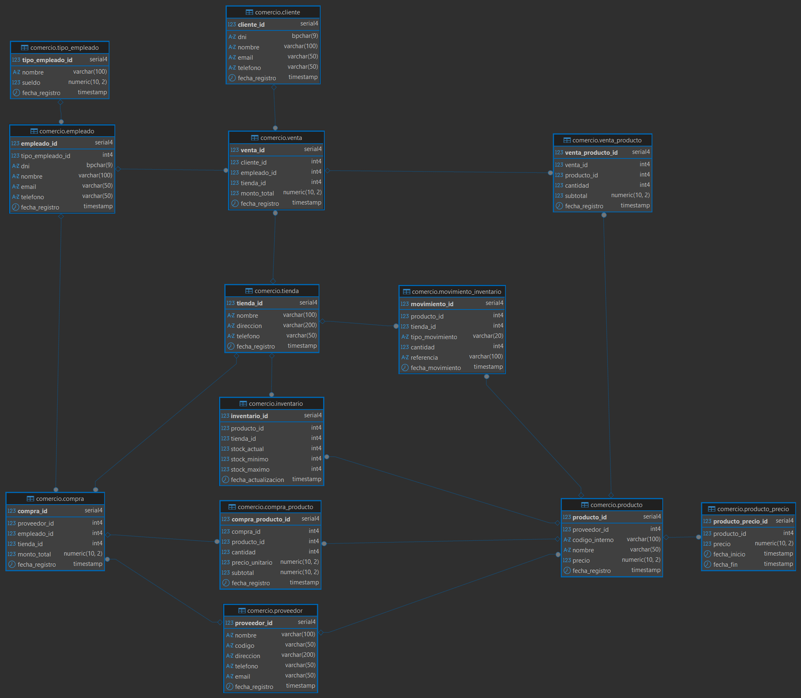

# [Día 2](https://drive.google.com/drive/folders/1j2tJ8m-lJDQOfeHJKJ4m601N32swS2O3): Bases de Datos Relacionales

## 2.1 - ¿Qué es una Base de Datos?

Una base de datos es un conjunto organizado de información estructurada que sirve para almacenar, gestionar, actualizar y acceder a grandes volúmenes de datos de forma rápida. Estamos en contacto con ellas a diario, por ejemplo, en la agenda de contactos de un móvil, en el sistema de una biblioteca o en la gestión de un supermercado.

## Bases de Datos Relacionales

El enfoque de la sesión son las bases de datos relacionales, que organizan la información en tablas compuestas por filas y columnas. Este modelo es el más utilizado en el entorno empresarial (más del 60%) y su comprensión es fundamental para aprender otros modelos de datos, además de ser un conocimiento con alta demanda laboral. Se diferencian de las bases de datos no relacionales, que tienen estructuras más flexibles y no requieren un esquema fijo.

### Componentes Clave

Los elementos básicos de una base de datos relacional son:
**- Tablas:** Son la unidad básica de almacenamiento, similares a una hoja de cálculo pero con reglas más estrictas.
**- Registros (Filas):** Cada fila representa una entidad individual y única, como un cliente específico o un producto.
**- Campos (Columnas):** Representan un atributo o característica de la entidad, como el nombre, la edad o el precio. Cada campo tiene un tipo de dato específico (texto, número, etc.).

#### Claves y Relaciones

Para que el sistema funcione de manera coherente, se utilizan claves:

**- Clave Primaria (Primary Key):** Es un campo que identifica de forma única cada registro en una tabla. No puede tener valores nulos ni duplicados. Por ejemplo, el ID_Cliente en una tabla de clientes.
**- Clave Foránea (Foreign Key):** Es un campo en una tabla que hace referencia a la clave primaria de otra tabla. Su función es conectar tablas y mantener la integridad de los datos, evitando registros "huérfanos".

Las relaciones son las conexiones lógicas entre tablas que permiten combinar información y evitar la repetición de datos. Los tipos de relaciones más comunes son:

**- Uno a muchos (1:N):** Un cliente puede tener muchos pedidos, pero cada pedido pertenece a un solo cliente.
**- Muchos a muchos (N:M):** Un equipo puede jugar en muchos estadios y un estadio puede alojar a muchos equipos.
**- Uno a uno (1:1):** Un país tiene un solo presidente y un presidente gobierna un solo país.

#### Diseño y Ventajas

El diseño de una base de datos se apoya en procesos como la normalización, que busca organizar los datos de forma eficiente para eliminar redundancia y mejorar la integridad. Para visualizar esta estructura se utilizan los Modelos Entidad-Relación (ERD), que representan las tablas (entidades), sus campos (atributos) y cómo se conectan (relaciones).

Las principales ventajas de este modelo son la organización estructurada, la integridad de los datos, la reducción de duplicidad y la capacidad de realizar consultas complejas combinando información de múltiples tablas mediante el lenguaje SQL.

-----

## 2.2 - Normalización de Bases de Datos Relacionales

La normalización es un proceso fundamental en el diseño de bases de datos relacionales que busca organizar los datos de manera eficiente. Sus objetivos principales son:
- Evitar duplicaciones innecesarias de datos.
- Asegurar la consistencia de los datos.
- Facilitar el mantenimiento y la actualización de la información.
El proceso se estructura en diferentes "formas normales" (1FN, 2FN, 3FN, etc.), donde cada una impone requisitos adicionales sobre la anterior.

--------------------------------------------------------------------------------
### Primera Forma Normal (1FN)
**- Regla:** Todos los campos deben ser atómicos, es decir, no pueden dividirse en partes más pequeñas. No se permiten listas ni grupos de datos que se repitan en una misma celda.
**- Ejemplo:**
    **- NO CUMPLE 1FN:** Una tabla con múltiples teléfonos en un solo campo.
    **- SOLUCIÓN en 1FN:** Se crea una fila para cada valor atómico.

--------------------------------------------------------------------------------
### Segunda Forma Normal (2FN)
**- Regla:** La tabla debe estar en 1FN y, además, todas las columnas que no forman parte de la clave deben depender de la clave primaria completa. Esta regla es especialmente relevante cuando se usan claves compuestas (formadas por más de una columna).
**- Ejemplo:**
    **- NO CUMPLE 2FN:** En la siguiente tabla, NombreProducto depende solo de ProductoID, que es solo una parte de la clave primaria (PedidoID, ProductoID).
    **- SOLUCIÓN en 2FN:** La tabla se divide en dos para eliminar la dependencia parcial.
        - Tabla PedidosProductos (PedidoID, ProductoID, Cantidad)
        - Tabla Productos (ProductoID, NombreProducto)

--------------------------------------------------------------------------------
### Tercera Forma Normal (3FN)
**- Regla:** La tabla debe estar en 2FN y no debe contener dependencias transitivas. Esto ocurre cuando una columna que no es clave depende de otra columna que tampoco es clave.
**- Ejemplo:**
    **- NO CUMPLE 3FN:** La columna Ciudad depende de CP (Código Postal), y CP a su vez depende de la clave ClienteID. Esto es una dependencia transitiva.
    **- SOLUCIÓN en 3FN:** Se separa la dependencia transitiva en una nueva tabla.
        - Tabla Clientes (ClienteID, Nombre, CP)
        - Tabla CodigosPostales (CP, Ciudad)

--------------------------------------------------------------------------------
### Otras Formas Normales
Existen formas normales más avanzadas para casos específicos, aunque en la práctica, la mayoría de las bases de datos de negocio alcanzan hasta la 3FN.
**- BCNF (Forma Normal de Boyce-Codd):** Es una versión más estricta y refinada de la 3FN.
**- 4FN y 5FN:** Se utilizan en escenarios complejos para tratar dependencias multivaloradas o de unión.

--------------------------------------------------------------------------------
### Conclusión del Proceso

En resumen, las reglas básicas de la normalización son:
**- 1FN:** Eliminar listas y grupos repetidos.
**- 2FN:** Asegurar que cada atributo dependa de la clave primaria completa.
**- 3FN:** Eliminar las dependencias transitivas entre columnas no clave.
**- Más allá (BCNF, 4FN, 5FN):** Para casos de uso avanzados.

## 2.3 Creación de un modelo E-R

Realizamos una actividad de creación de un modelo Entidad-Relación con el objetivo de abstraer correctamente dicho modelo y poner en práctica los conocimientos adquiridos en clase.

**- Diagrama:** https://dbdiagram.io/home

**- Datos:** https://mockaroo.com/