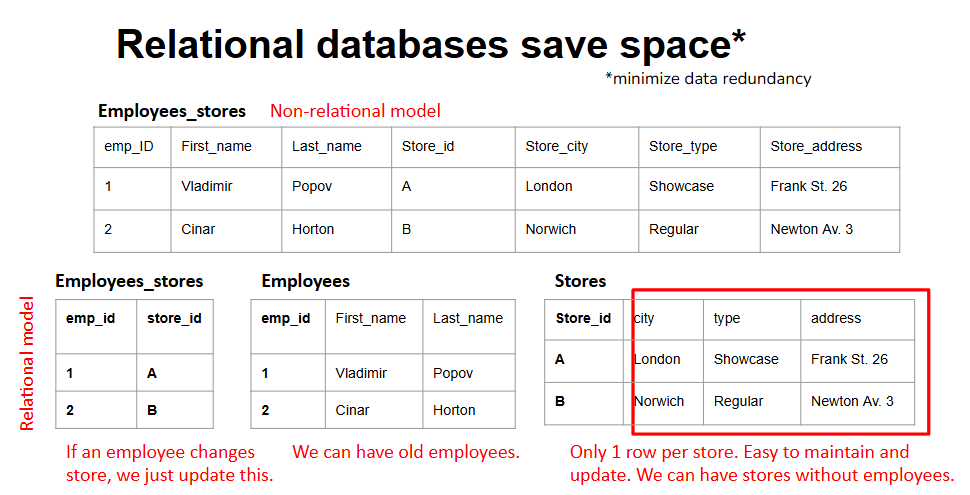
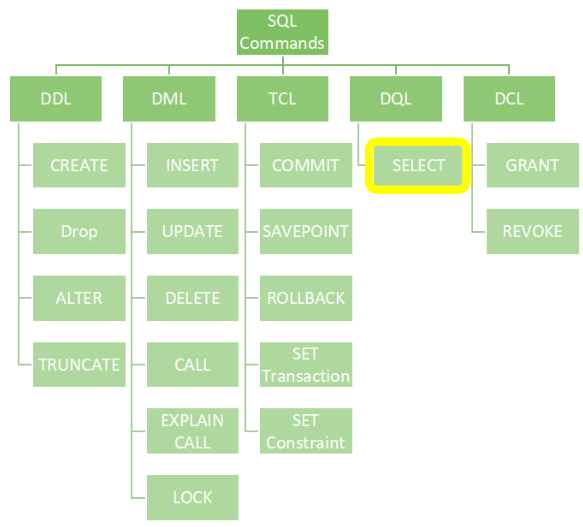
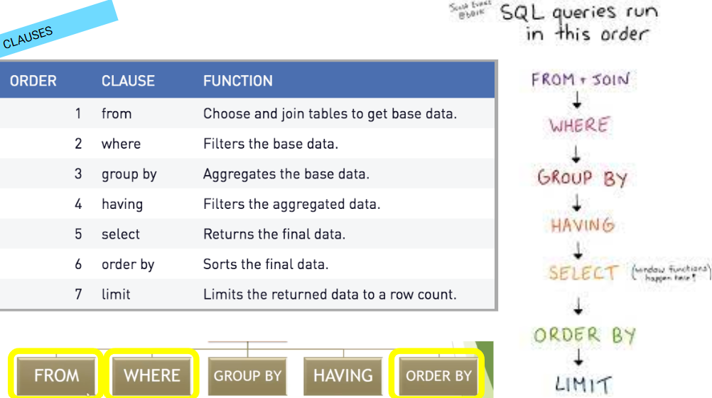
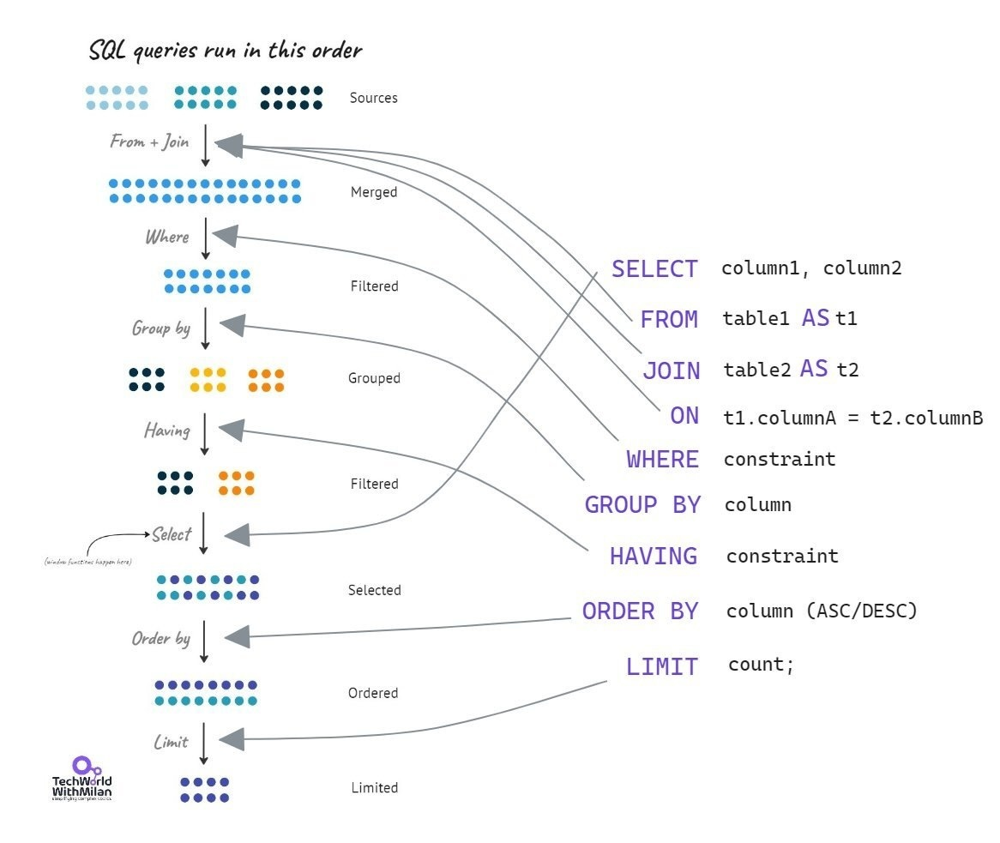

# [Día 3](https://drive.google.com/drive/folders/1NHdh8eHaNpAHoZh9O9Nt1zDvEygBo8kG): Introducción a SQL (Structured Query Language)

## ¿Qué es SQL?
SQL (Structured Query Language) es el lenguaje estándar utilizado para interactuar con bases de datos relacionales. Permite crear, modificar, consultar y administrar datos, siendo la herramienta fundamental en el manejo de la información estructurada.

## Breve historia

SQL fue desarrollado en la década de 1970 por investigadores de IBM como parte del proyecto System R. Con el tiempo, su eficacia llevó a que se convirtiera en un estándar oficial reconocido por ANSI (American National Standards Institute) e ISO (International Organization for Standardization).

## Estándares y variantes

A lo largo de los años han surgido diferentes implementaciones de SQL, adaptadas a distintos motores de bases de datos. Entre las más utilizadas se encuentran:

-  SQL estándar: la base común definida por ANSI/ISO.
- T-SQL (Transact-SQL): implementado por Microsoft SQL Server y Sybase.
- PL/SQL (Procedural Language/SQL): variante de Oracle que extiende SQL con capacidades procedurales.

## Principales actores en la industria

Las bases de datos relacionales son ampliamente utilizadas en la industria tecnológica, con grandes proveedores como Oracle, Microsoft, Amazon y Google, quienes ofrecen soluciones escalables y de alto rendimiento basadas en SQL.

## Representación gráfica

A continuación, se muestran algunos esquemas y diagramas que ilustran la estructura de SQL, sus comandos principales, las cláusulas más comunes y un ejemplo de plan de ejecución:

